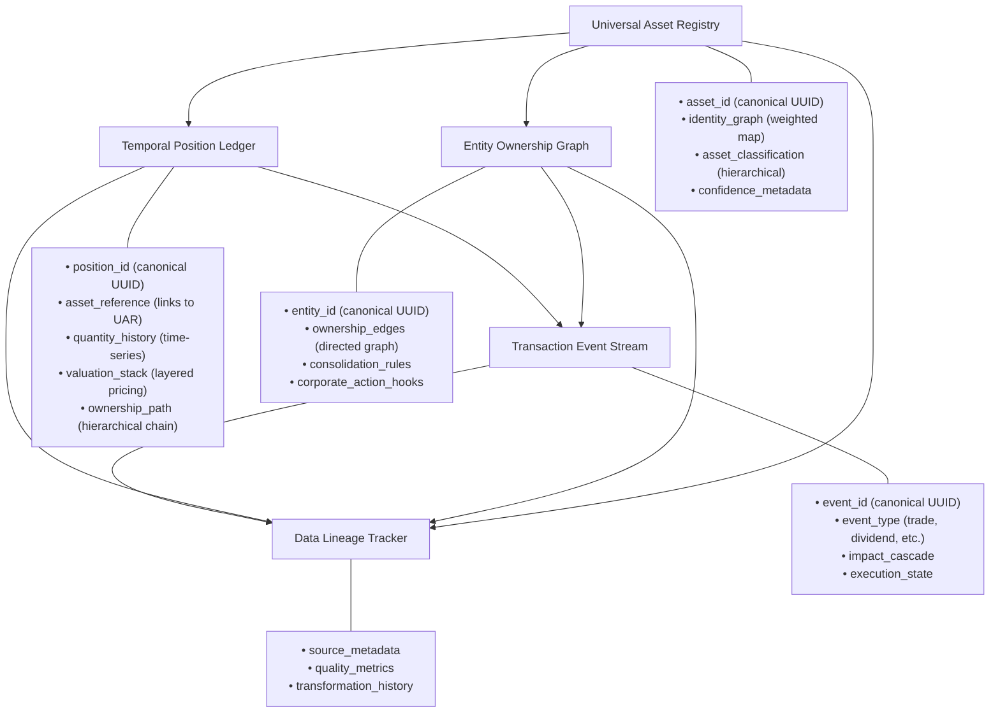
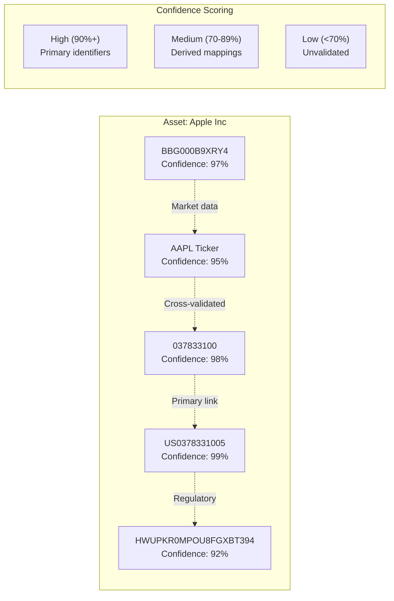
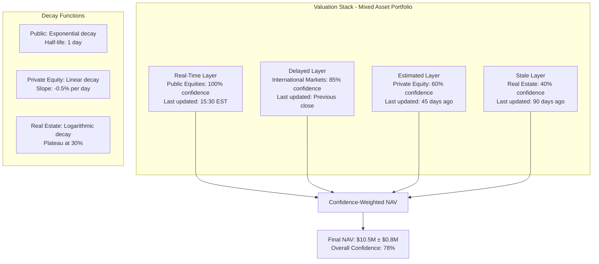
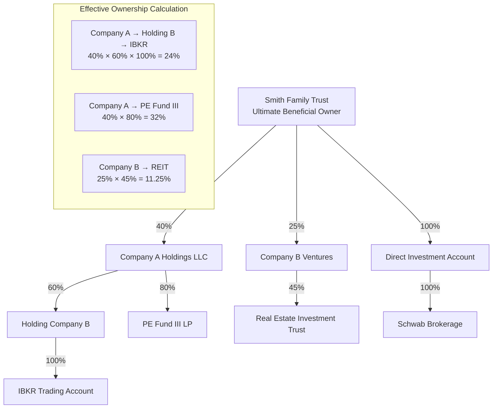
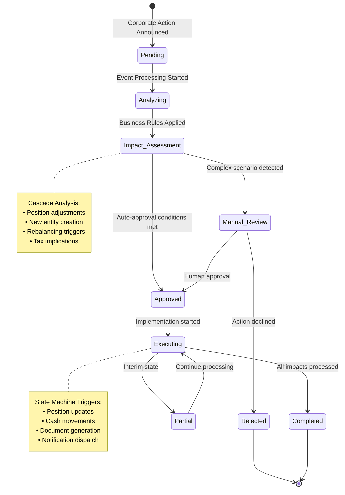
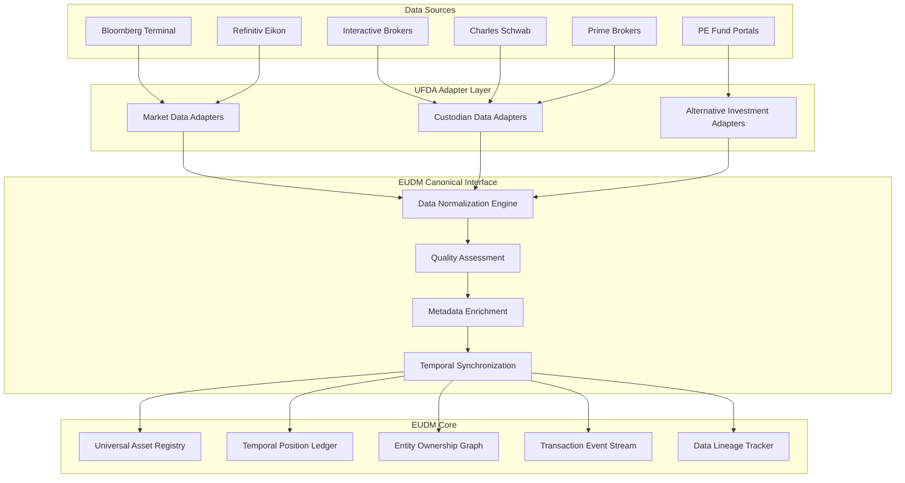
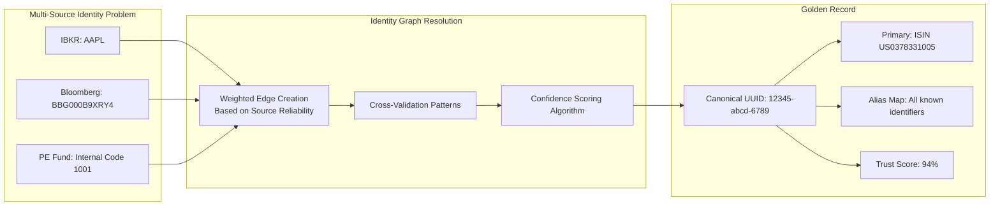
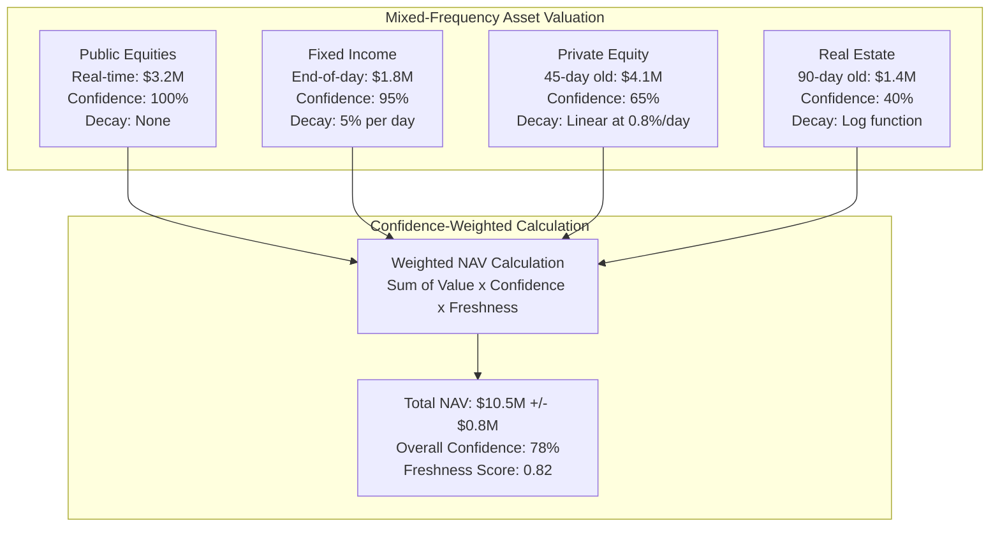
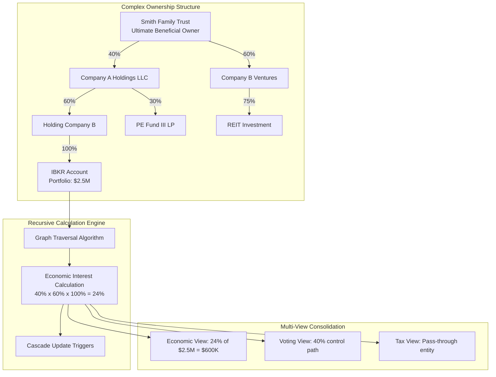
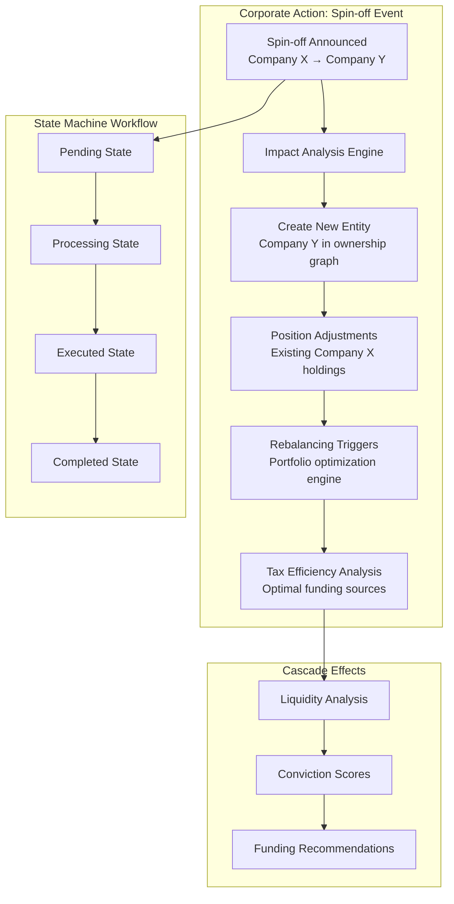

# Core Schema Architecture

The EUDM operates on five foundational entity types, each with standardized core fields but extensible schemas to accommodate source-specific enrichment:

**Universal Asset Registry**
- `asset_id` (canonical UUID)
- `identity_graph` (weighted map of all known identifiers: CUSIP, ISIN, ticker, fund codes)
- `asset_classification` (hierarchical: security → instrument → issuer → sector)
- `confidence_metadata` (source reliability scores, last validation timestamp)

**Temporal Position Ledger**
- `position_id` (canonical UUID)
- `asset_reference` (links to Universal Asset Registry)
- `quantity_history` (time-series with confidence intervals)
- `valuation_stack` (layered pricing: real-time, delayed, estimated, stale)
- `ownership_path` (hierarchical chain from ultimate beneficial owner)

**Entity Ownership Graph**
- `entity_id` (canonical UUID for legal entities)
- `ownership_edges` (directed graph with percentage weights and effective dates)
- `consolidation_rules` (economic vs. voting vs. tax treatment)
- `corporate_action_hooks` (event triggers for automatic recalculation)

**Transaction Event Stream**
- `event_id` (canonical UUID)
- `event_type` (trade, dividend, spin-off, capital call, etc.)
- `impact_cascade` (predicted effects across ownership hierarchy)
- `execution_state` (pending, partial, complete, failed)

**Data Lineage Tracker**
- `source_metadata` (provider, endpoint, refresh frequency)
- `quality_metrics` (completeness, accuracy, timeliness scores)
- `transformation_history` (audit trail of all data mutations)

## Identity Graph for Universal Asset Registry

## Valuation Stack for Temporal Position Ledger

## Entity Ownership Graph Hierarchy Example

## Transaction Event Stream State Machine

## Universal Financial Data Adapter (UFDA) Architecture

# How the EUDM Solves Each Puzzle

## 1. The Identity Crisis: Golden Record Creation

The EUDM's **Universal Asset Registry** maintains an identity graph that doesn't force a single identifier but instead builds probabilistic links between all known identifiers. When IBKR provides a ticker, Bloomberg sends a CUSIP, and a PE fund PDF references an internal code, the system creates weighted edges between these identifiers, with confidence scores based on source reliability and cross-validation patterns. The "golden record" emerges naturally as the highest-confidence canonical representation.

## 2. The Time Paradox: Mixed-Frequency NAV

The **Temporal Position Ledger's** valuation stack handles this elegantly. Real-time equity prices occupy the top layer with 100% confidence, while 45-day old PE valuations sit lower with decaying confidence scores. The EUDM applies asset-class-specific staleness decay functions—public equities decay rapidly, real estate slowly. Total NAV becomes a confidence-weighted calculation where every component contributes based on its freshness and volatility profile, providing both a point estimate and confidence interval.

## 3. The Hierarchy Complexity: Look-Through Calculations

The **Entity Ownership Graph** recursively traverses ownership chains to calculate true economic exposure. When the family owns 40% of Company A → 60% of Holding B → IBKR Account C, the graph computes the effective 24% economic interest while maintaining separate voting and tax views. Changes at any level trigger cascade recalculations, ensuring consolidated reporting remains accurate even as ownership structures evolve.

## 4. Transactional Edge Cases: Complex Corporate Actions

The **Transaction Event Stream** models corporate actions as state machines with impact cascades. A spin-off isn't just a single event—it's a workflow that creates new entities in the ownership graph, adjusts positions in the ledger, and may trigger rebalancing rules. Capital calls that require liquidation invoke the system's portfolio optimization engine, which considers tax efficiency, conviction scores, and liquidity profiles to recommend optimal funding sources.

# The Path Forward

The EUDM isn't just a data model—it's the architectural foundation for transforming how mid-tier family offices operate. By treating complexity, uncertainty, and temporal dynamics as first-class concepts rather than edge cases, we create a system that doesn't just aggregate data but truly synthesizes intelligence from the fragmented financial landscape.

This approach transforms the family office from a reactive administrator of wealth into a proactive orchestrator of sophisticated financial strategies, finally delivering on the promise of institutional-grade capabilities at mid-market scale.